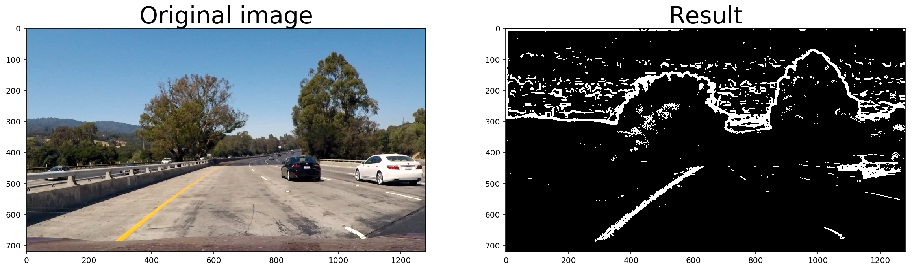

# Advanced Lane Finding Project

The goals / steps of this project are the following:

* Compute the camera calibration matrix and distortion coefficients given a set of chessboard images.
* Apply a distortion correction to raw images.
* Use color transforms, gradients, etc., to create a thresholded binary image.
* Apply a perspective transform to rectify binary image ("birds-eye view").
* Detect lane pixels and fit to find the lane boundary.
* Determine the curvature of the lane and vehicle position with respect to center.
* Warp the detected lane boundaries back onto the original image.
* Output visual display of the lane boundaries and numerical estimation of lane curvature and vehicle position.


## [Rubric](https://review.udacity.com/#!/rubrics/571/view) Points

Here I will consider the rubric points individually and describe how I addressed each point in my implementation.

---

### Writeup / README

#### 1. Provide a Writeup / README that includes all the rubric points and how you addressed each one.  You can submit your writeup as markdown or pdf.  [Here](https://github.com/udacity/CarND-Advanced-Lane-Lines/blob/master/writeup_template.md) is a template writeup for this project you can use as a guide and a starting point.

You're reading it!

### Camera Calibration

#### 1. Briefly state how you computed the camera matrix and distortion coefficients. Provide an example of a distortion corrected calibration image.

The code for this step is contained in the first code cell of the [Jupyter Notebook](advanced_line_detection.ipynb).

I start by preparing "object points", which will be the (x, y, z) coordinates of the chessboard corners in the world. Here I am assuming the chessboard is fixed on the (x, y) plane at z=0, such that the object points are the same for each calibration image.  Thus, `objp` is just a replicated array of coordinates, and `objpoints` will be appended with a copy of it every time I successfully detect all chessboard corners in a test image.  `imgpoints` will be appended with the (x, y) pixel position of each of the corners in the image plane with each successful chessboard detection.

I then used the output `objpoints` and `imgpoints` to compute the camera calibration and distortion coefficients using the `cv2.calibrateCamera()` function.  I applied this distortion correction to the test image using the `cv2.undistort()` function and obtained this result:


### Pipeline (single images)

#### 1. Provide an example of a distortion-corrected image.

To demonstrate this step, I will describe how I apply the distortion correction to one of the test images like this one:


The code is located in "Camera calibration" section of the [Jupyter Notebook](advanced_line_detection.ipynb).

#### 2. Describe how (and identify where in your code) you used color transforms, gradients or other methods to create a thresholded binary image.  Provide an example of a binary image result.

I used a combination of color and gradient thresholds to generate a binary image:

1. Sobel Operator with `x` direction applied to the S channel (function `asobel_thresh()`)
2. Magnitude of the Gradient applied to the S channel (function `mag_thresh()`)
3. Direction of the Gradient applied to the S channel (function `dir_threshold()`)
4. Red channel threshold (function `threshold_pipeline()`)
5. Saturation channel threshold (function `threshold_pipeline()`)



#### 3. Describe how (and identify where in your code) you performed a perspective transform and provide an example of a transformed image.

The code for my perspective transform includes a function called `warp_perspective()`, which appears in "Perspective transform" section of the [Jupyter Notebook](advanced_line_detection.ipynb).  The `warp_perspective()` function takes as inputs an image (`image`), as well as source (`src`) and destination (`dst`) points.  I chose the hardcode the source and destination points in the following manner:

```python
src = np.float32([
    [270,670],
    [594,450],
    [689,450],
    [1030,670]
])
dst = np.float32([
    [300,730],
    [300,0],
    [900,0],
    [900,730]
])
```

This resulted in the following source and destination points:

| Source        | Destination   |
|:-------------:|:-------------:|
| 270,670       | 300,730       |
| 594,450       | 300,0         |
| 689,450       | 900,0         |
| 1030,670      | 900,730       |

I verified that my perspective transform was working as expected by drawing the `src` and `dst` points onto a test image and its warped counterpart to verify that the lines appear parallel in the warped image.


#### 4. Describe how (and identify where in your code) you identified lane-line pixels and fit their positions with a polynomial?

I used 2 sliding windows (for left and right lines) to detect lines on the warped 'bird-eye view' image. The code lives in `find_lanes()` function, which is located in
"Processing Each Image" section of the [Jupyter Notebook](advanced_line_detection.ipynb).


_NOTE: there's a weird bug when I plotted the sliding window visualisation - some green rectangles are missing edges. Meanwhile on the final video (see below) everything is rendered correctly._

#### 5. Describe how (and identify where in your code) you calculated the radius of curvature of the lane and the position of the vehicle with respect to center.

Same function `find_lanes()`, last 5 lines. The curvature is calculated using this formula:


When applied to second order polynomial, the formula becomes


Car position on the lane is simply an offset between the middle point between two lines and the center of the image (assuming the camera is located in the middle of the car).

#### 6. Provide an example image of your result plotted back down onto the road such that the lane area is identified clearly.

I implemented this step in the function `draw_line_detection()` in the section "Processing Each Image".  Here is an example of my result on a test image:


---

### Pipeline (video)

#### 1. Provide a link to your final video output.  Your pipeline should perform reasonably well on the entire project video (wobbly lines are ok but no catastrophic failures that would cause the car to drive off the road!).

Here's a [link to my video result](output.mp4). Also, [link to YouTube](https://youtu.be/iKgGf_j9yJA).

---

### Discussion

#### 1. Briefly discuss any problems / issues you faced in your implementation of this project.  Where will your pipeline likely fail?  What could you do to make it more robust?

Lane finding algorithm definitely can be improved. Due to limited time I had for this project, I run sliding window search for every frame instead of finding lanes based on previous frames. That would make algorithm less wobbly because it would have a region of interest to search based on previous frames.

The pipeline might fail if there are sharp lines in the middle of the lane (tire marks, temporary line marks in construction zones, uneven pavement). It would definitely fail if lane splits in two. Also, it assumes the road is flat, which is not true for mountain roads.
